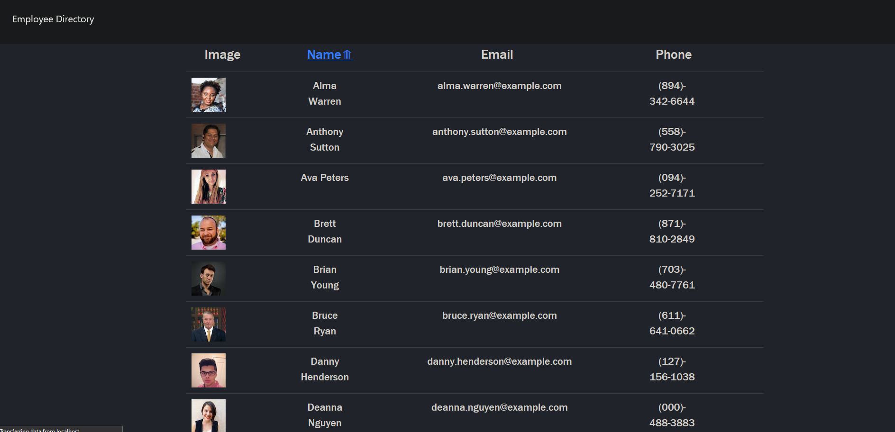
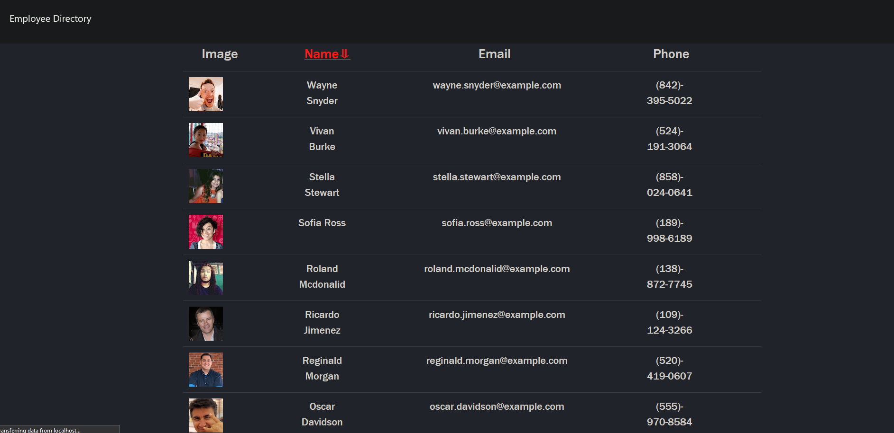

 

# 
 **User-Directory** 

ASCENDING

---
DESCENDING

--- 

## **Table Of Contents** 

---

1. [Description](#description)
2. [Installation](#installation)
3. [Usage](#usage)
4. [Review and Contribute](#github)
--- 

## 
  **Description** 
 

--- 

  This is a user/employee directory built with react.  The UI is broken into components, state management, and responds to user events.

--- 
 
## 
  **Installation** 

--- 
 
_The app deployment is linked below._
 <ol> <li>To install locally you will need to clone the repo and run npm i to install all dependencies.
 </li>
  <li> Next, input npm start in the command line in order to open the dev server and view the app in the browser with the localhost:3000.
  </li>
</ol>

--- 

## 
  **Usage** 

--- 

The interaction in this application are limited to name sorting, either desc or asc.

--- 

## 
  **Github and Email** 

--- 

### _Github:_ [Employee-Directory](https://github.com/CalvinJacobsen/user-directory)

### _Deployed App:_ [calvinjacobsen.github.io/user-directory](https://calvinjacobsen.github.io/user-directory/)

### _Email:_ jaco1932@umn.edu

--- 